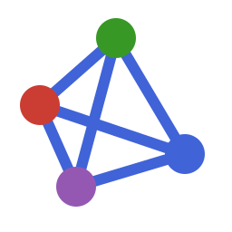
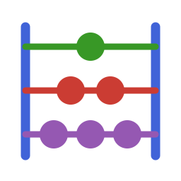
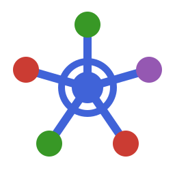
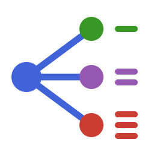
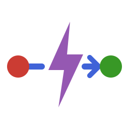
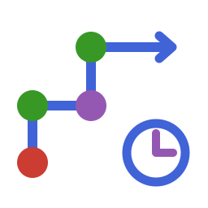

# Package documentation appearance

All 15 package sites use Documenter.jl's built-in themes without custom CSS or
JavaScript. Documenter owns the typography, colors, sidebar, search, theme chooser
and docstring controls. The native footer contains links back to the ecosystem.

Each package checks in `docs/src/assets/logo.svg` and `favicon.ico`. Documenter
discovers the SVG automatically; `Documenter.HTML(assets = ["assets/favicon.ico"])`
adds the browser-tab icon. No theme or icon download is needed during a build.
Keep the canonical URL, `DOCS_PRETTY_URLS` support, `warnonly=false` and
`checkdocs=:exports` in each `docs/make.jl`.

## Icon family

The original vector symbols use only the four colors in the
[official Julia logo palette](https://github.com/JuliaLang/julia-logo-graphics#color-definitions):
blue `#4063D8`, green `#389826`, red `#CB3C33`, and purple `#9558B2`.
Transparent backgrounds work with Documenter's light and dark themes. Rounded
strokes and simple silhouettes keep the symbols legible at small sizes; package
names are rendered as text by Documenter rather than baked into the icons.

| Icon | Package | Meaning |
| --- | --- | --- |
|  | Networks.jl | Connected vertices: the shared network-data foundation. |
|  | SNA.jl | Examining network structure, centrality and cohesion. |
|  | ERGM.jl | A probability distribution over network configurations. |
|  | ERGMCount.jl | One, two and three beads: integer-valued ties. |
|  | ERGMEgo.jl | A focal ego and its sampled local neighborhood. |
|  | ERGMMulti.jl | Multiple relational layers over common actors. |
|  | ERGMRank.jl | An ego's ordering of alters, with rank strokes. |
|  | ERGMUserterms.jl | Writing custom network statistics in code. |
|  | TERGM.jl | Ties forming and dissolving across network waves. |
|  | Siena.jl | Actor-oriented choices in network micro-steps. |
|  | REM.jl | A directed interaction occurring as an event. |
|  | Relevent.jl | Interaction history with decaying memory weights. |
|  | NetworkDynamic.jl | Activity spells with closed onsets and open termini. |
|  | TSNA.jl | Time-respecting paths and temporal reachability. |
|  | NDTV.jl | A network play symbol inside an animation frame. |

## Maintain the assets

Edit the canonical SVGs in `icons/`. To regenerate a favicon after editing its
SVG, use librsvg and ImageMagick (asset-authoring tools, not build dependencies):

```bash
rsvg-convert -w 256 -h 256 tools/docs-theme/icons/Networks.svg |
    magick png:- -define icon:auto-resize=64,48,32,16 tools/docs-theme/icons/Networks.ico
```

The historically named sync command now copies each package's icon and favicon,
removes the retired `snwj-docs.css` and `snwj-docs.js` files, and checks the
Documenter asset configuration. From the site checkout, with Julia 1.12+:

```bash
julia tools/sync_documentation_theme.jl
julia tools/sync_documentation_theme.jl --check
```

An optional first argument selects a different sibling workspace. The package
list comes from `tools/workspace/Project.toml`. Each package builds independently
using its checked-in assets. The umbrella package directory displays those same
icons from `/Package.jl/dev/assets/logo.svg`.

Build and inspect the sites in the combined preview before publishing. Check the
icons in light and dark mode and the favicons at 16, 32, 48 and 64 pixels. Commit
package changes separately; the sync command itself never publishes anything.
